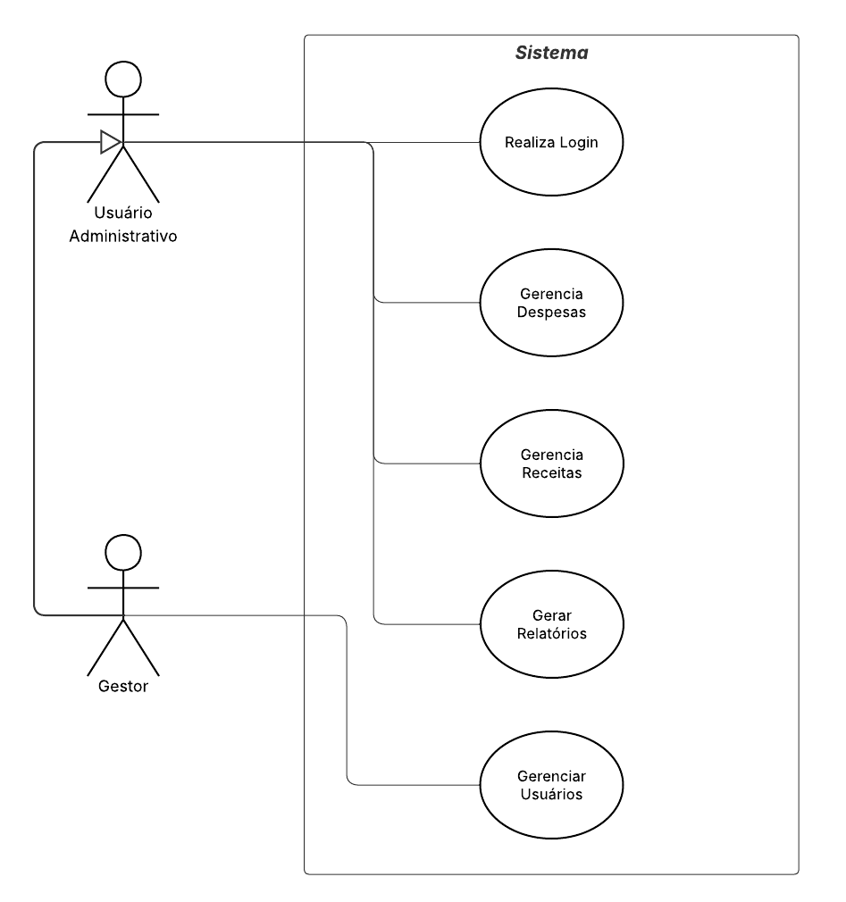
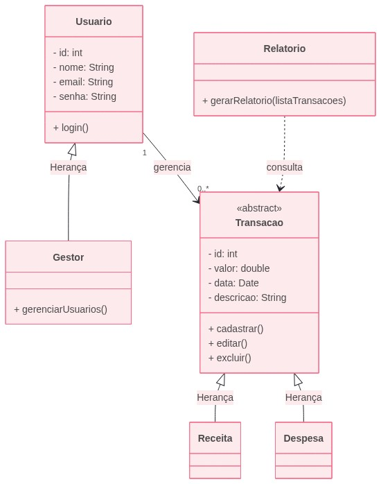

# 3. DOCUMENTO DE ESPECIFICAÇÃO DE REQUISITOS DE SOFTWARE

Nesta parte do trabalho você deve detalhar a documentação dos requisitos do sistema proposto de acordo com as seções a seguir. Ressalta-se que aqui é utilizado como exemplo um sistema de gestão de cursos de aperfeiçoamento.

## 3.1 Objetivos deste documento
Descrever e especificar as necessidades dos usuários do sistema Controle Certo, voltado para o gerenciamento e organização das movimentações financeiras empresariais, definindo os requisitos que devem ser atendidos pelo sistema proposto.

## 3.2 Escopo do produto

### 3.2.1 Nome do produto e seus componentes principais
O produto será denominado Controle Certo – Sistema de Gestão Financeira Empresarial.
O sistema será composto pelos seguintes módulos principais:

- Módulo de Receitas: responsável pelo registro e gerenciamento das entradas financeiras da empresa.
- Módulo de Despesas: responsável pelo registro e controle das saídas financeiras.
- Módulo de Relatórios: responsável pela geração e visualização de relatórios financeiros, permitindo análise das movimentações.
- Módulo de Usuários: responsável pelo gerenciamento de usuários, autenticação e controle de acesso ao sistema.

### 3.2.2 Missão do produto
Permitir o registro, organização e visualização das movimentações financeiras de empresas, proporcionando maior controle sobre receitas e despesas, facilitando a análise do fluxo de caixa e contribuindo para uma gestão financeira mais eficiente.

### 3.2.3 Limites do produto
O Controle Certo não fornece integração direta com instituições bancárias, processamento de pagamentos ou emissão de boletos, controle contábil avançado, gestão de folha de pagamentos, funcionalidades de auditoria financeira detalhada e suporte a múltiplas empresas.

### 3.2.4 Benefícios do produto

| # | Benefício | Valor para o Cliente |
|--------------------|------------------------------------|----------------------------------------|
|1	| Centralização das informações financeiras |	Essencial |
|2 | Facilidade no registro de receitas e despesas | Essencial | 
|3 | Melhor visualização do fluxo de caixa | Essencial | 
|4	| Apoio à tomada de decisão financeira	| Recomendável | 
|5	| Redução de erros comuns em controles manuais	| Recomendável | 
|6	| Interface simples e acessível	| Essencial | 

## 3.3 Descrição geral do produto

### 3.3.1 Requisitos Funcionais

| Código | Requisito Funcional | Descrição | Prioridade |
|--------|---------------------|-----------|------------|
| RF1 | Cadastrar usuário | O usuário realiza seu cadastro informando nome, e-mail e senha. | Essencial |
| RF2 | Autenticar usuário | O usuário realiza autenticação no sistema por meio de e-mail e senha. | Essencial |
| RF3 | Registrar receitas | O usuário registra receitas informando valor, data e descrição. | Essencial |
| RF4 | Registrar despesas | O usuário registra despesas informando valor, data e descrição. | Essencial |
| RF5 | Consultar movimentações | O usuário visualiza as receitas e despesas registradas. | Essencial |
| RF6 | Filtrar movimentações | O usuário filtra as movimentações por período ou tipo (receita ou despesa). | Desejável |
| RF7 | Visualizar fluxo de caixa | O usuário visualiza o saldo financeiro com base nas receitas e despesas registradas. | Desejável |
| RF8 | Gerar relatórios | O usuário gera relatórios financeiros com base nas movimentações cadastradas. | Opcional |
| RF9 | Gerenciar usuários | O gestor gerencia os usuários do sistema. | Desejável |
| RF10 | Definir empresa | O gestor gerencia os dados pertinentes a empresa. | Essencial |

### 3.3.2 Requisitos Não Funcionais

| Código | Requisito Não Funcional |
|--------|--------------------------|
| RNF1 | Pelo menos 90% dos usuários em um grupo de teste (composto por pessoas com nível básico de informática) devem completar a tarefa de (ex: gerar relatórios) com sucesso na primeira tentativa, cometendo no máximo 2 erros de navegação. |
| RNF2 | O sistema deve ser acessível via navegador web e compatível com Google Chrome (>= 147.0.7727.138), Mozilla Firefox (>= 150.0.1) e Microsoft Edge (>= 147.0.3912.98). |
| RNF3 | O sistema deve garantir tempo de resposta adequado, com carregamento das principais funcionalidades em até 3 segundos em condições normais de uso. |
| RNF4 | O sistema deve garantir que apenas usuários autenticados tenham acesso às funcionalidades, por meio de login com e-mail e senha. |
| RNF5 | O sistema deve garantir a integridade e consistência dos dados, evitando perdas, inconsistências ou duplicações indevidas. |
| RNF6 | O sistema deve possuir alta disponibilidade, garantindo seu funcionamento contínuo durante a maior parte do tempo de uso. |

### 3.3.3 Usuários 

| Ator | Descrição |
|--------------------|------------------------------------|
| Gestor |	Usuário gerente do sistema que pode cadastrar e gerir acessos além de ter acesso geral. |
| Usuário Administrativo |	Usuário responsável pelo acompanhamento, cadastro e gerenciamento de despesas e receitas. |
| ... |	... |	... |

## 3.4 Modelagem do Sistema

### 3.4.1 Diagrama de Casos de Uso
Como observado no diagrama de casos de uso da Figura 1, o usuário gestor pode cadastrar e gerir os acessos do sistema, enquanto o Usuário Administrativo exerce o papel de cadastrar as despesas e receitas e acompanhar o fluxo de caixa.

#### Figura 1: Diagrama de Casos de Uso do Sistema.

 
### 3.4.2 Descrições de Casos de Uso

#### Realizar Login (CSU01)

Sumário: O usuário realiza autenticação no sistema para acessar suas funcionalidades.

Ator Primário: Usuário Administrativo.

Pré-condições: O usuário deve estar previamente cadastrado no sistema.

Fluxo Principal:

1) O usuário acessa a tela de login.
2) O sistema solicita e-mail e senha.
3) O usuário informa suas credenciais.
4) O sistema valida os dados informados.
5) O sistema permite o acesso ao sistema.

Fluxo Alternativo (4): Dados inválidos

a) O sistema identifica que as credenciais são inválidas.  
b) O sistema informa o erro ao usuário.  
c) O sistema solicita a inserção correta dos dados.  

Pós-condições: O usuário está autenticado e apto a utilizar o sistema.

#### Gerenciar Receitas (CSU02)

Sumário: O usuário realiza o gerenciamento (inclusão, alteração, exclusão e consulta) das receitas.

Ator Primário: Usuário Administrativo.

Pré-condições: O usuário deve estar autenticado no sistema.

Fluxo Principal:

1) O usuário acessa a funcionalidade de receitas.
2) O sistema apresenta as operações disponíveis: inclusão, alteração, exclusão e consulta.
3) O usuário seleciona a operação desejada.
4) O sistema executa a operação escolhida.
5) O sistema atualiza as informações exibidas.

#### Gerenciar Despesas (CSU03)

Sumário: O usuário realiza o gerenciamento (inclusão, alteração, exclusão e consulta) das despesas.

Ator Primário: Usuário Administrativo.

Pré-condições: O usuário deve estar autenticado no sistema.

Fluxo Principal:

1) O usuário acessa a funcionalidade de despesas.
2) O sistema apresenta as operações disponíveis: inclusão, alteração, exclusão e consulta.
3) O usuário seleciona a operação desejada.
4) O sistema executa a operação escolhida.
5) O sistema atualiza as informações exibidas.

#### Gerar Relatórios (CSU04)

Sumário: O usuário gera relatórios financeiros com base nas movimentações registradas.

Ator Primário: Usuário Administrativo.

Pré-condições: O usuário deve estar autenticado no sistema.

Fluxo Principal:

1) O usuário acessa a funcionalidade de relatórios.
2) O sistema solicita critérios de filtro (período, tipo...).
3) O usuário informa os parâmetros desejados.
4) O sistema processa os dados.
5) O sistema apresenta o relatório ao usuário.

#### Gerenciar Usuários (CSU05)

Sumário: O gestor realiza o gerenciamento (inclusão, alteração, exclusão e consulta) dos usuários do sistema.

Ator Primário: Gestor.

Pré-condições: O gestor deve estar autenticado no sistema.

Fluxo Principal:

1) O gestor acessa a funcionalidade de gerenciamento de usuários.
2) O sistema apresenta as operações disponíveis: inclusão, alteração, exclusão e consulta.
3) O gestor seleciona a operação desejada.
4) O sistema executa a operação escolhida.
5) O sistema atualiza as informações exibidas

Fluxo Alternativo (3): Inclusão

a) O gestor solicita a inclusão de um novo usuário.  
b) O sistema apresenta o formulário de cadastro.  
c) O gestor informa os dados do usuário.  
d) O sistema valida e salva as informações.  

Fluxo Alternativo (3): Remoção

a) O gestor seleciona um usuário.  
b) O gestor solicita a remoção.  
c) O sistema realiza a remoção.  

Fluxo Alternativo (3): Alteração

a) O gestor seleciona um usuário.  
b) O gestor altera os dados do usuário.  
c) O sistema atualiza os dados.  

### 3.4.3 Diagrama de Classes 

A Figura 2 mostra o diagrama de classes do sistema. A Matrícula deve conter a identificação do funcionário responsável pelo registro, bem com os dados do aluno e turmas. Para uma disciplina podemos ter diversas turmas, mas apenas um professor responsável por ela.

#### Figura 2: Diagrama de Classes do Sistema.
 

### 3.4.4 Descrições das Classes

| # | Nome | Descrição |
|---|------|-----------|
| 1 | Usuário Administrativo | Armazena os dados dos usuários do sistema, como nome, e-mail e senha, permitindo autenticação e acesso às funcionalidades. |
| 2 | Gestor | Especialização da classe Usuário Administrativo, responsável por gerenciar os usuários do sistema. |
| 3 | Receita | Representa as entradas financeiras registradas pelo usuário, contendo informações como valor, data e descrição. |
| 4 | Despesa | Representa as saídas financeiras registradas pelo usuário, contendo informações como valor, data e descrição. |
| 5 | Relatorio | Responsável pela geração e apresentação de relatórios financeiros com base nas receitas e despesas cadastradas. |
