# 4. PROJETO DO DESIGN DE INTERAÇÃO

## 4.1 Personas

### Persona 1 - Carlos, o empreendedor organizado
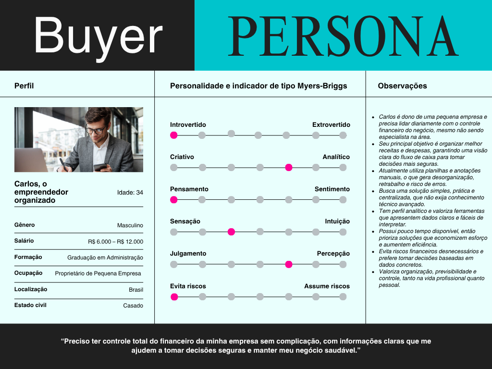

### Persona 2 - Charles, analista administrativo
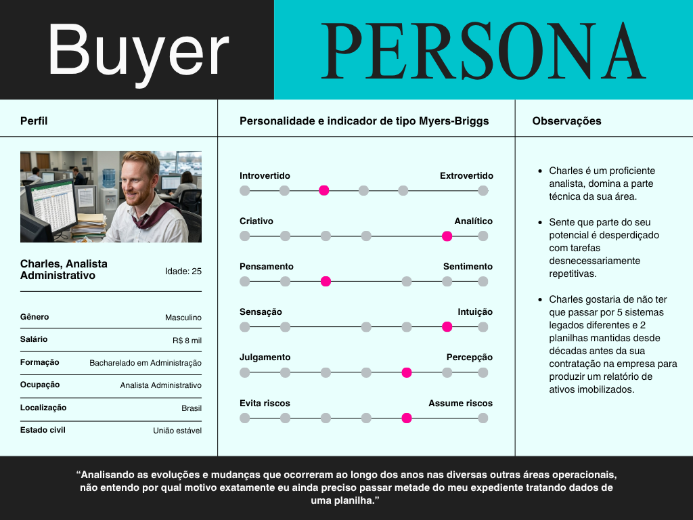

### Persona 3 - Ana, a empreendedora focada em crescimento
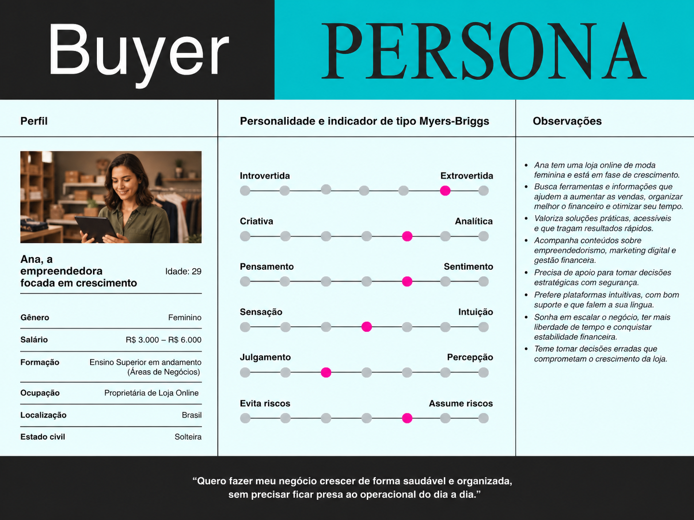  

### Persona 4 - Ricardo Souza, o Operador de Lançamentos Financeiros  
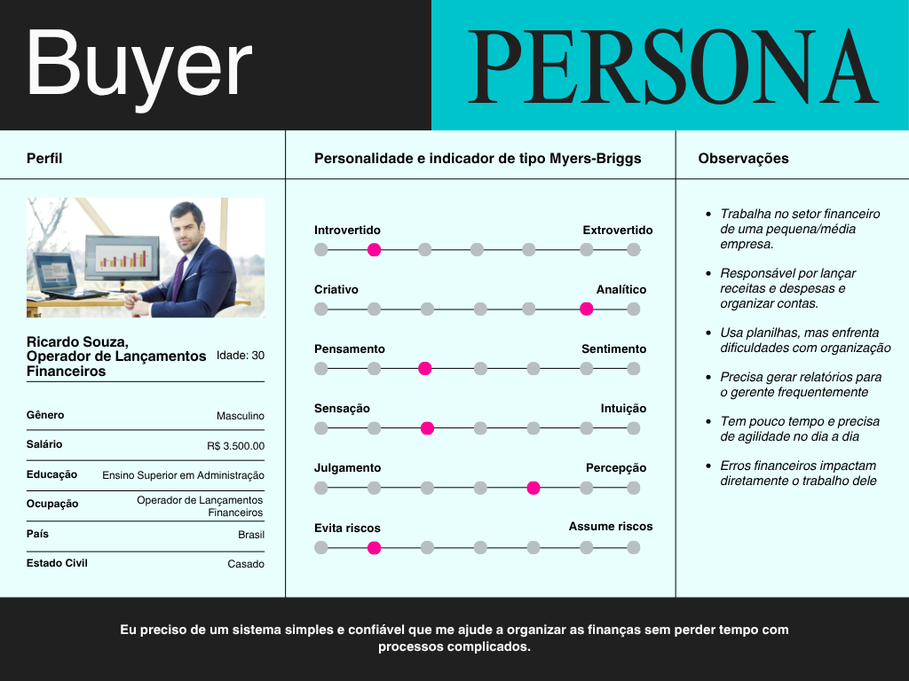  

### Persona 5 - Lívia Freitas, a Analista Financeira Estratégica  
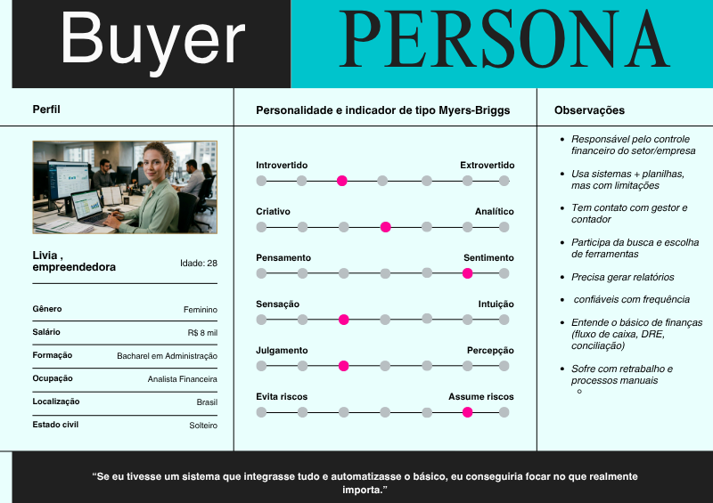  

### Persona 6 - Renato Farias, o Organizador Relutante 
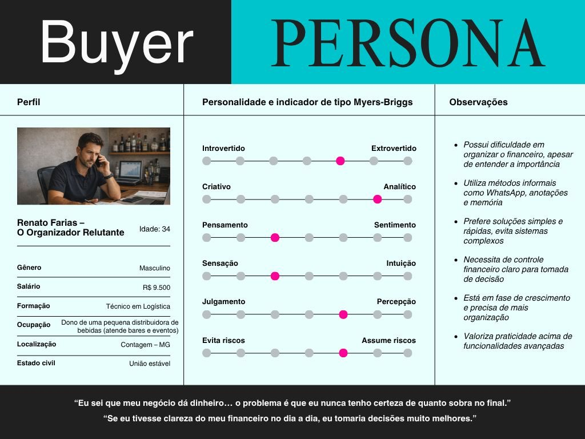  

## 4.2 Mapa de Empatia

### Mapa de Empatia 1 - Carlos, o empreendor organizado

### Mapa de Empatia 2 - Charles, o analista administrativo
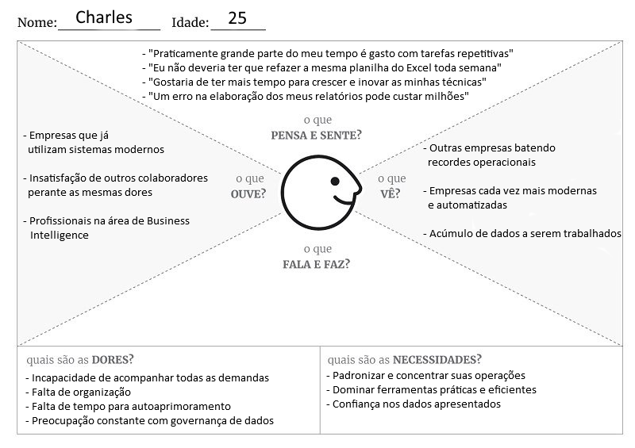

### Mapa de Empatia 3 - Ana, a empreendedora focada em crescimento
  

### Mapa de Empatia 4 - Ricardo Souza, o Operador de Lançamentos Financeiros  

### Mapa de Empatia 5 - Lívia Freitas, a Analista Financeira Estratégica 
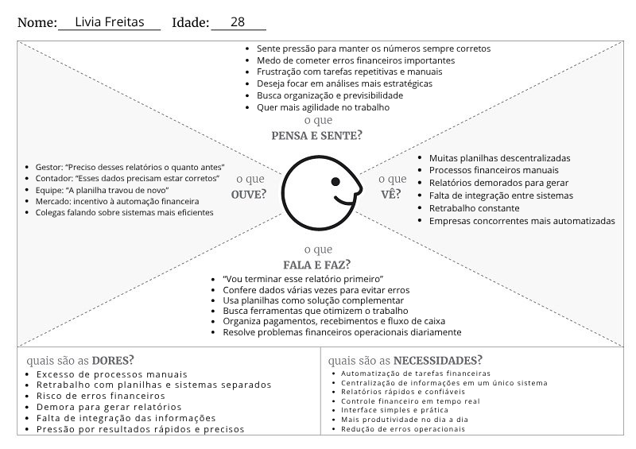

### Mapa de Empatia 6 - Renato Farias, o Organizador Relutante 
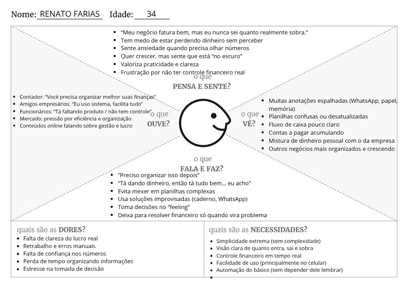

## 4.3 Protótipos das Interfaces
Apresente nesta seção os protótipos de alta fidelidade do sistema proposto. A fidelidade do protótipo refere-se ao nível de detalhes e funcionalidades incorporadas a ele. Assim, um protótipo de alta fidelidade é uma representação interativa do produto, baseada no computador ou em dispositivos móveis. Esse protótipo já apresenta maior semelhança com o design final em termos de detalhes e funcionalidades. No desenvolvimento dos protótipos, devem ser considerados os princípios gestálticos, as recomendações ergonômicas e as regras de design (como as 8 regras de ouro). É importante descrever no texto do relatório como os princípios gestálticos e as regras de ouro foram seguidas no projeto das interfaces. Nesta etapa deve-se dar uma ênfase na implementação do software de modo que possam ser realizados os testes com usuários na etapa seguinte.

## Protótipo - Landing

### 1. Objetivo da Tela
O objetivo da tela de landing é apresentar de forma concisa e direta o sistema, trazendo informações e características gerais sem sobrecarregar o visitante em fins de ofertar e demonstrar o serviço.

### 2. Princípios Gestálticos
- **Similaridade:** Os elementos visuais que exercem as funções de links e botões são padronizados e de fácil identificação, evidenciando ao usuário as opções disponíveis de ações.

- **Continuidade:** São utilizadas ambas linhas visíveis e invísiveis para delimitar diferentes partes da tela, dividindo e manuseando a atenção do usuário apropriadamente.

- **Figura-fundo:** Figuras são utilizadas e separadas do fundo em fins de destacar e reforçar principalmente o público-alvo do sistema.

- **Pregnância:** Formas e estruturas simples e de fácil compreensão foram utilizadas, priorizando legibilidade e eficiência comunicativa.

- **Região Comum:** Os links à diferentes partes informativas do sistema estão concentrados em um único grupo, separado do grupo de ações (Começar, Demonstração)

### 3. Regras de Ouro
- **Consistência:** Todos os elementos, links, botões e texto seguem padrões, fontes e cores padronizadas.

- **Feedback Informativo:** Links e botões fornecem respostas visuais apropriadas.

- **Minimizar Carga de Memória:** Todos os caminhos e parte da interface são distintos e de fácil identificação, fazendo com que a memorização de dados seja desnecessária.

- **Prevenir Erros:** Comunicação clara e assertiva reduz as chances do usuário escolher o que não deseja.

- **Desfazer Ações:** Na tela de landing, não há ações a serem desfeitas a não ser a progressão natural entre páginas.

- **Atalhos:** O usuário sempre tem acesso direto às opções relevantes.

- **Comunicação de Fim de Ação:** As ações disponíveis evidenciam claramente o fim.

- **Controle do Usuário:** Nenhuma ação ou decisão é tomada sem a interação do usuário.

## Protótipo - Contato  
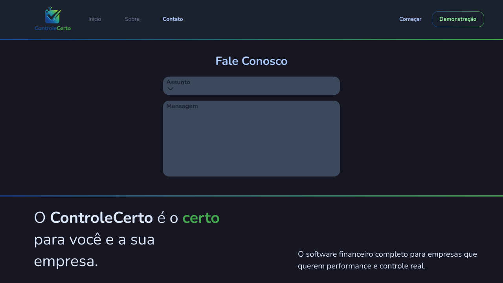

### 1. Objetivo da Tela
O objetivo da tela de contato é permitir que o usuário entre em contato com a equipe do ControleCerto de forma simples e acessível, possibilitando o envio de dúvidas, sugestões ou solicitações por meio de um formulário intuitivo.

A tela também busca reforçar a identidade visual da plataforma e transmitir confiabilidade ao usuário por meio de uma interface limpa e organizada.

### 2. Princípios Gestálticos

- **Similaridade:** Os campos do formulário seguem o mesmo padrão visual, mantendo consistência de cores, formatos e estilos.

- **Proximidade:** Os elementos relacionados ao contato foram agrupados em uma única seção centralizada, facilitando a identificação e utilização do formulário.

- **Continuidade:** A disposição dos elementos conduz naturalmente o usuário pelo fluxo da tela, iniciando pelo menu superior, passando pelo formulário e finalizando na mensagem institucional.

- **Pregnância:** Foram utilizados poucos elementos visuais e componentes simples, tornando a interface mais limpa e de fácil compreensão.

### 3. Regras de Ouro

- **Consistência:** A tela mantém a identidade visual utilizada nas demais páginas do sistema, preservando cores, tipografia e componentes.

- **Feedback Informativo:** Os campos do formulário foram organizados de forma clara para facilitar o preenchimento e compreensão do usuário.

- **Estética e Design Minimalista:** Apenas elementos essenciais foram exibidos, evitando excesso de informações e melhorando a experiência visual.

- **Visibilidade:** O formulário de contato está centralizado e destacado na tela, facilitando sua localização e utilização.

## Protótipo - Sobre Nós  
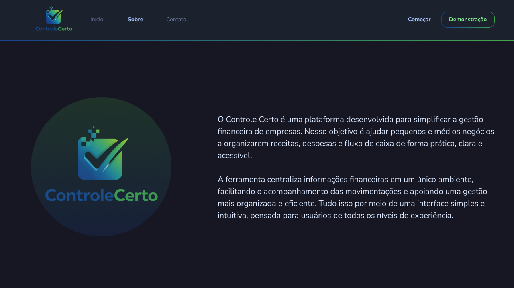

### 1. Objetivo da Tela
O objetivo da tela “Sobre Nós” é apresentar ao usuário informações sobre o ControleCerto, destacando a proposta da plataforma, seus objetivos e benefícios de forma clara e acessível.

A tela busca transmitir credibilidade e reforçar a identidade visual do sistema, aproximando o usuário da proposta da aplicação.

### 2. Princípios Gestálticos

- **Similaridade:** Os elementos visuais seguem o mesmo padrão de cores, tipografia e estilo utilizado nas demais páginas do sistema.

- **Proximidade:** O conteúdo textual e os elementos gráficos foram organizados próximos entre si, facilitando a leitura e compreensão das informações.

- **Continuidade:** A disposição da logo e dos textos conduz o olhar do usuário de maneira natural pela interface.

- **Pregnância:** Foram utilizados poucos elementos visuais e uma estrutura simples, permitindo rápida identificação do conteúdo principal da página.

### 3. Regras de Ouro

- **Consistência:** A tela mantém a identidade visual aplicada em todo o sistema, utilizando os mesmos padrões de design e navegação.

- **Estética e Design Minimalista:** Apenas informações essenciais sobre a plataforma foram apresentadas, evitando excesso de conteúdo visual.

- **Visibilidade:** As informações institucionais estão posicionadas em destaque, facilitando a leitura e compreensão pelo usuário.

- **Feedback Informativo:** O conteúdo textual apresenta de forma objetiva a finalidade e os benefícios do sistema ao usuário.

## Protótipo - Login
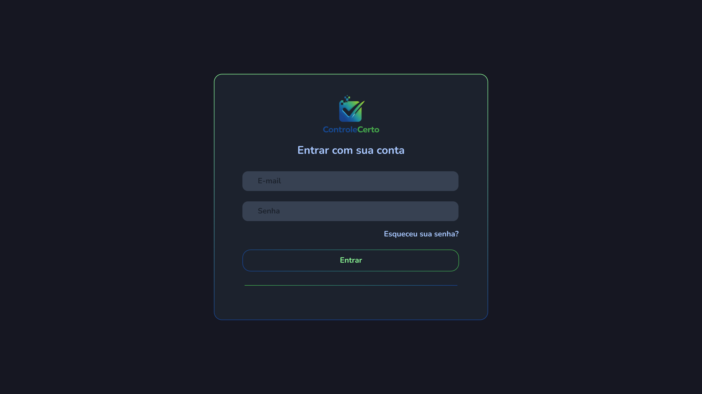

### 1. Objetivo da Tela
O objetivo da tela de login é possibilitar ao usuário a sua autenticação no sistema. O usuário deve informar o e-mail e senha previamente cadastrados pelo administrador do sistema. Ao clicar no botão "Entrar", o acesso é condicionado à verificação das credenciais informadas.

### 2. Princípios Gestálticos
- **Similaridade:** Os elementos visuais que exercem as funções de caixas de texto e botões são padronizados e de fácil identificação, evidenciando ao usuário os campos à serem preenchidos e as ações a serem tomadas.

- **Proximidade:** Todos os campos e botões estão organizados em um só grupo de layout, formando um formulário de login familiar para o usuário.

- **Continuidade:** Todos os elementos visuais podem ser compreendidos sequencialmente de forma natural, guiando o usuário apropriadamente.

- **Pregnância:** Formas e estruturas simples e de fácil compreensão foram utilizadas, priorizando legibilidade e eficiência.

- **Foco:** O botão de "Entrar" é estabelecido como a principal ação a ser tomada pelo usuário, considerando tamanho e cores utilizadas.

### 3. Regras de Ouro
- **Consistência:** Todos os elementos, links, botões e texto seguem padrões, fontes e cores padronizadas.

- **Feedback Informativo:** Quaisquer erros são informados ao usuário, sejam esses erros referente aos dados informados ou indisponibilidade do sistema.

- **Minimizar Carga de Memória:** Todos os caminhos e parte da interface são distintos e de fácil identificação, fazendo com que a memorização de dados seja desnecessária.

- **Prevenir Erros:** A validação dos dados preenchidos e a composição da interface auxilia na prevenção de erros por parte do usuário.

- **Desfazer Ações:** Na tela de login, o usuário pode editar e, portanto, desfazer livremente os dados preenchidos.

- **Atalhos:** Não há necessidade de atalhos, visto que o usuário possui somente duas ações a serem tomadas na tela de login.

- **Comunicação de Fim de Ação:** O fim é comunicado claramente no momento em que o usuário pressiona o botão de "Entrar", seja exibindo um erro caso apropriado ou seguindo para a próxima tela.

- **Controle do Usuário:** Nenhuma ação ou decisão é tomada sem a interação do usuário.

## Protótipo - Visão Geral
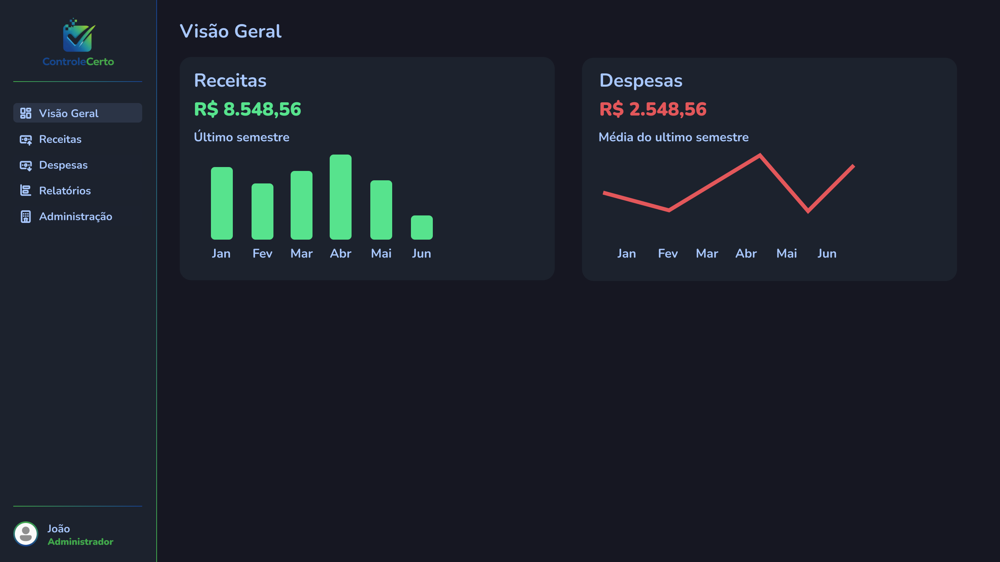

### 1. Objetivo da Tela
O objetivo da tela de visão geral é apresentar uma visualização simples, direta e intuitiva dos dados mais relevantes ao usuaŕio, tendo acesso à gráficos sobre as receitas e despesas por semestre.
A forma de visualização também busca ser uma alternativa à elaboração manual de apresentações (PowerPoints e dashboards do PowerBI, por exemplo).

### 2. Princípios Gestálticos
- **Similaridade:** Os gráficos seguem a mesma linguagem de design, apresentando legendas e cores apropriadas para aprimorar a legibilidade e compreensão do usuário.

- **Proximidade:** Cada visualização de gráfico na Visão Geral são separados por "cards", também facilitando a compreensão do usuário.

- **Continuidade:** Todos os elementos visuais podem ser compreendidos sequencialmente de forma natural, guiando o usuário apropriadamente.

- **Pregnância:** Foram utilizados estilos de gráficos populares e de fácil compreensão para o usuário.

### 3. Regras de Ouro
- **Consistência:** Na Visão Geral, as cores e formatos seguem padronizadas assim como os gráficos.

- **Feedback Informativo:** Na Visão Geral, não há feedback informativo ao usuário por conta do caráter informativo da tela, sem apresentar ações para o usuário.

## Protótipo - Receitas  
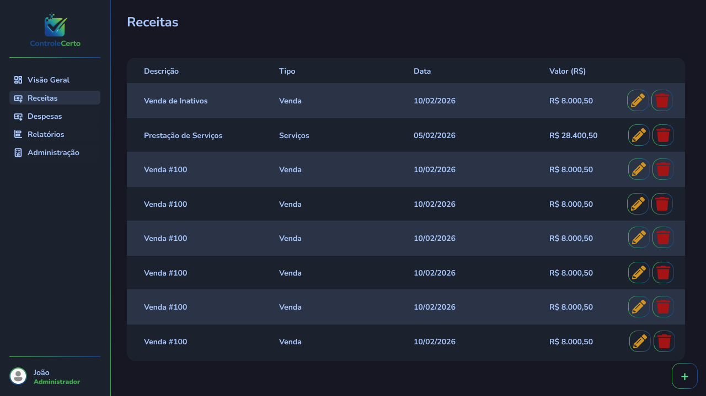

### 1. Objetivo da Tela
O objetivo da tela de receitas é permitir que o usuário visualize e acompanhe todas as entradas financeiras registradas no sistema de forma organizada e intuitiva.

A tela busca facilitar o controle das receitas empresariais, apresentando informações importantes como descrição, categoria, data e valor das movimentações financeiras.

### 2. Princípios Gestálticos

- **Similaridade:** Os elementos da tabela seguem o mesmo padrão visual, utilizando cores, espaçamentos e tipografia padronizados para melhorar a leitura das informações.

- **Proximidade:** As informações relacionadas às receitas foram agrupadas em linhas e colunas organizadas, facilitando a interpretação dos dados pelo usuário.

- **Continuidade:** A estrutura da tabela conduz naturalmente a leitura horizontal das informações, permitindo rápida identificação dos dados registrados.

- **Pregnância:** Foram utilizados componentes simples e familiares, como tabelas e botões de ação, tornando a interface mais fácil de compreender.

### 3. Regras de Ouro

- **Consistência:** A tela mantém o mesmo padrão visual utilizado nas demais áreas do sistema, preservando identidade visual e navegação.

- **Feedback Informativo:** As informações financeiras são apresentadas de forma clara e objetiva, auxiliando o usuário na visualização das receitas cadastradas.

- **Estética e Design Minimalista:** Apenas informações essenciais foram exibidas, evitando excesso de elementos visuais e melhorando a experiência do usuário.

- **Visibilidade:** O botão de adicionar receita permanece visível e destacado, facilitando o acesso rápido à funcionalidade de cadastro.

## Protótipo - Despesas  
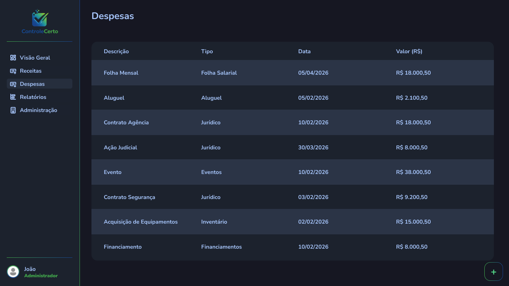

### 1. Objetivo da Tela
O objetivo da tela de despesas é permitir que o usuário visualize e acompanhe todas as saídas financeiras registradas no sistema de maneira organizada e intuitiva.

A tela busca facilitar o controle dos gastos empresariais, apresentando informações relevantes como descrição, categoria, data e valor das despesas cadastradas.

### 2. Princípios Gestálticos

- **Similaridade:** Os elementos da tabela seguem o mesmo padrão visual, utilizando cores, tipografia e espaçamentos consistentes para melhorar a legibilidade das informações.

- **Proximidade:** As informações relacionadas às despesas foram agrupadas em linhas e colunas organizadas, facilitando a visualização e interpretação dos dados financeiros.

- **Continuidade:** A estrutura da tabela direciona naturalmente a leitura do usuário pelas informações apresentadas, permitindo rápida identificação das despesas registradas.

- **Pregnância:** Foram utilizados componentes visuais simples e familiares, como tabelas e botões de ação, facilitando a compreensão da interface.

### 3. Regras de Ouro

- **Consistência:** A tela mantém o mesmo padrão visual utilizado nas demais áreas do sistema, preservando identidade visual, cores e navegação.

- **Feedback Informativo:** As despesas são apresentadas de forma clara e objetiva, auxiliando o usuário no acompanhamento financeiro da empresa.

- **Estética e Design Minimalista:** Apenas informações essenciais foram exibidas, evitando excesso de elementos visuais e contribuindo para uma interface limpa.

- **Visibilidade:** O botão de adicionar despesa permanece destacado e acessível, facilitando o cadastro rápido de novas movimentações.

## Protótipo - Cadastro de Receitas e Despesas  
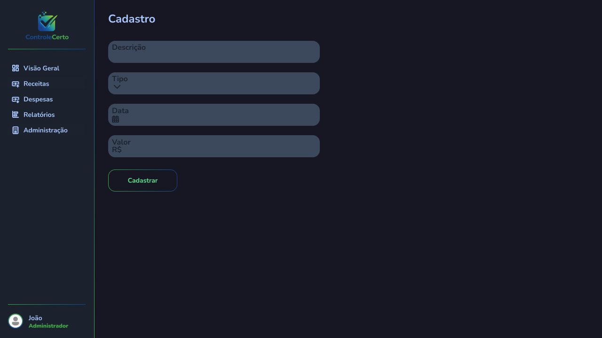

### 1. Objetivo da Tela
O objetivo da tela de cadastro é permitir que o usuário registre receitas ou despesas no sistema de forma simples, rápida e organizada.

A tela busca facilitar o preenchimento das informações financeiras, permitindo o registro de dados como descrição, tipo, data e valor da movimentação.

### 2. Princípios Gestálticos

- **Similaridade:** Os campos do formulário seguem o mesmo padrão visual, utilizando cores, formatos e estilos consistentes.

- **Proximidade:** Os elementos relacionados ao cadastro foram agrupados próximos entre si, facilitando o preenchimento e compreensão do formulário.

- **Continuidade:** A disposição vertical dos campos conduz naturalmente o usuário pelo fluxo de preenchimento das informações.

- **Pregnância:** Foram utilizados componentes simples e familiares, como campos de entrada, seleção e botão de ação, tornando a interface intuitiva.

### 3. Regras de Ouro

- **Consistência:** A tela mantém o mesmo padrão visual utilizado nas demais áreas do sistema, preservando identidade visual e navegação.

- **Feedback Informativo:** Os campos do formulário foram organizados de maneira clara para auxiliar o usuário durante o cadastro das movimentações.

- **Estética e Design Minimalista:** Apenas informações essenciais foram exibidas, evitando excesso de elementos visuais e facilitando o uso da interface.

- **Visibilidade:** O botão de cadastro permanece destacado na tela, facilitando a confirmação da ação pelo usuário.

## Protótipo - Relatórios  
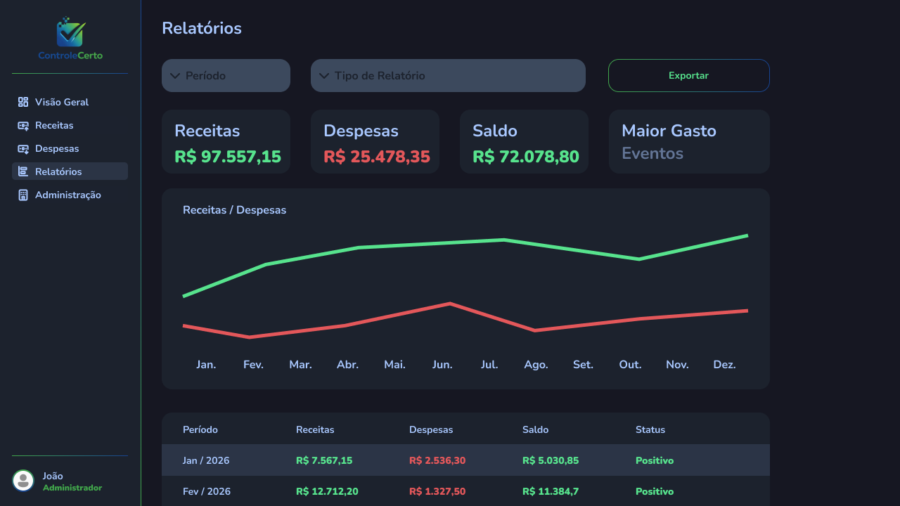

### 1. Objetivo da Tela
O objetivo da tela de relatórios é permitir que o usuário gere relatórios em Excel, visualize receitas, despesas e saldo da empresa de forma simples, organizada e intuitiva, auxiliando no acompanhamento financeiro e na tomada de decisões.

### 2. Princípios Gestálticos

- **Similaridade:** Os cards financeiros seguem o mesmo padrão visual, utilizando cores consistentes para facilitar a identificação das informações.

- **Proximidade:** Os elementos da tela foram agrupados conforme suas funções, separando filtros, indicadores, gráfico e tabela.

- **Continuidade:** A disposição dos elementos guia o usuário naturalmente pela interface, iniciando pelos filtros e finalizando na tabela de dados.

- **Pregnância:** Foram utilizados componentes visuais simples e conhecidos, como gráficos e tabelas, facilitando a compreensão das informações.

### 3. Regras de Ouro

- **Consistência:** A tela mantém o mesmo padrão visual utilizado nas demais áreas do sistema.

- **Feedback Informativo:** Os dados financeiros são apresentados de forma clara e objetiva para facilitar a interpretação do usuário.

- **Redução da Sobrecarga de Memória:** As principais informações ficam visíveis na tela, auxiliando na comparação dos dados financeiros.

- **Estética e Design Minimalista:** Apenas informações relevantes foram exibidas, mantendo a interface limpa e organizada.

## Protótipo - Usuário  
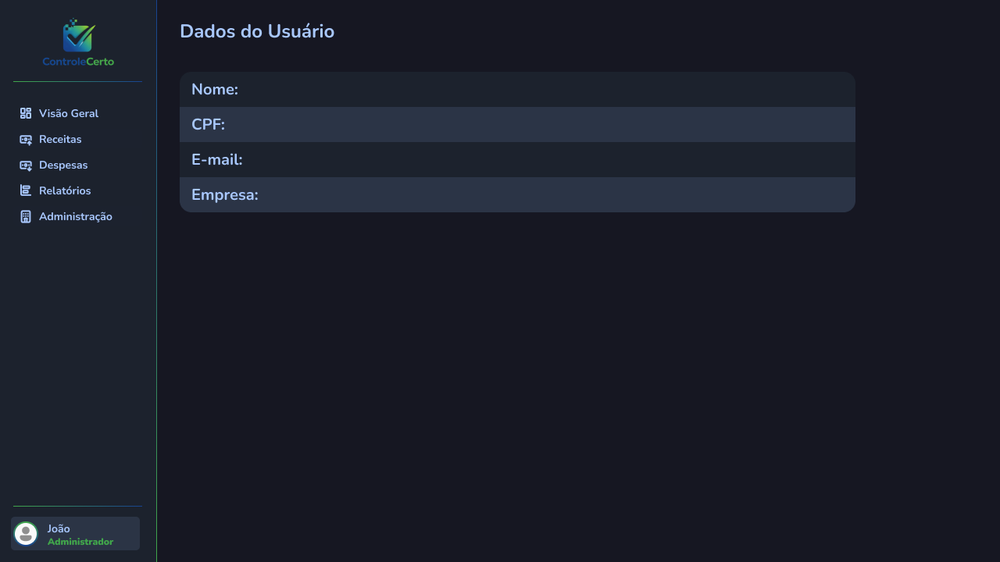

### 1. Objetivo da Tela
O objetivo da tela de dados do usuário é apresentar de forma clara e organizada as informações cadastrais do usuário autenticado no sistema. A tela exibe dados essenciais como nome, CPF, e-mail e empresa, permitindo que o usuário consulte seu perfil de maneira rápida e direta.

### 2. Princípios Gestálticos

- **Similaridade:** Todos os campos de informação seguem o mesmo padrão visual, mesma cor de fundo, tipografia e espaçamento, transmitindo coesão e facilitando a leitura dos dados.

- **Proximidade:** Os campos estão agrupados em um único bloco central, indicando ao usuário que todas aquelas informações pertencem ao mesmo contexto, o perfil do usuário.

- **Continuidade:** A disposição vertical dos campos guia o olhar do usuário de cima para baixo de forma natural e sequencial, facilitando a leitura progressiva das informações.

- **Pregnância:** O layout minimalista e simétrico reduz a carga cognitiva, tornando a tela imediatamente compreensível mesmo para usuários menos experientes.

### 3. Regras de Ouro

- **Consistência:** A tela de Dados do Usuário mantém o mesmo padrão de cores, fontes e estrutura das demais telas do sistema, preservando a identidade visual do ControleCerto e garantindo previsibilidade na navegação.

- **Feedback Informativo:** Por se tratar de uma tela predominantemente informativa e de consulta, não há ações diretas disponíveis ao usuário, dispensando a necessidade de feedbacks de interação nesta visualização.

- **Consistência:** A tela de Dados do Usuário mantém o mesmo padrão de cores, fontes e estrutura das demais telas do sistema, preservando a identidade visual do ControleCerto e garantindo previsibilidade na navegação.

- **Feedback Informativo:** Por se tratar de uma tela predominantemente informativa e de consulta, não há ações diretas disponíveis ao usuário, dispensando a necessidade de feedbacks de interação nesta visualização.

- **Estética e Design Minimalista:** Apenas as informações essenciais do perfil foram exibidas, evitando excesso de elementos visuais e proporcionando uma interface limpa e de fácil leitura.

## 4.4 Testes com Protótipos
Nesta seção você deve apresentar os testes realizados com usuários utilizando os protótipos de alta fidelidade desenvolvidos na seção anterior. O objetivo é avaliar a usabilidade, a clareza das informações e a adequação do design às necessidades das personas definidas no projeto.

Cada integrante do grupo deverá aplicar o teste com um usuário distinto, preferencialmente alinhado ao perfil das personas criadas. Devem ser definidas previamente as tarefas que o usuário deverá executar no protótipo (por exemplo: realizar um cadastro, buscar um produto, concluir uma compra).

Durante a aplicação do teste, registre observações sobre comportamentos, dúvidas, erros e comentários feitos pelo usuário, bem como o tempo necessário para a execução de cada tarefa. Ao final, colete o feedback do participante, destacando pontos positivos e aspectos a serem melhorados.

Os resultados obtidos por todos os integrantes devem ser consolidados, apresentando uma análise geral com os principais problemas encontrados, oportunidades de melhoria e as ações previstas para o projeto final. 
