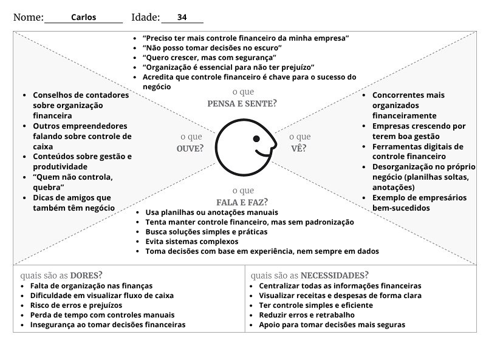
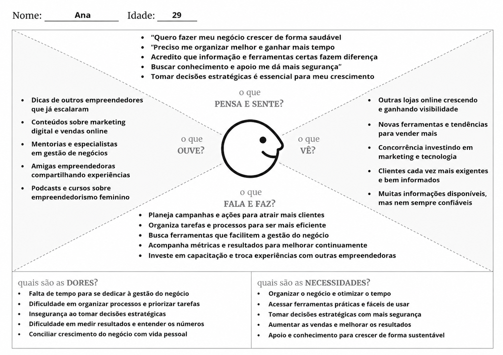
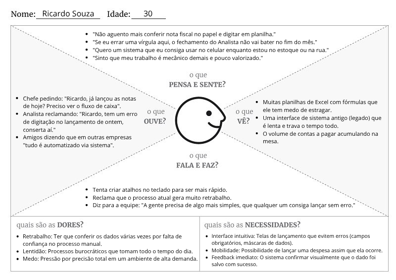
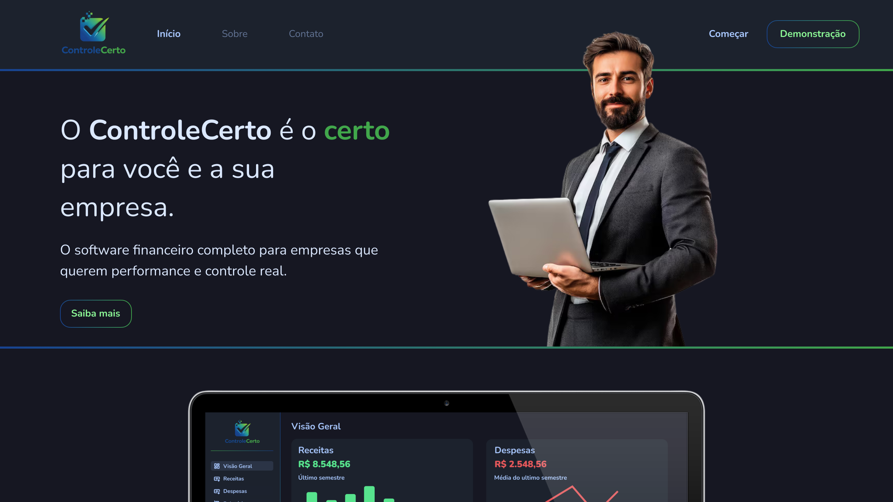

# 4. PROJETO DO DESIGN DE INTERAÇÃO

## 4.1 Personas

### Persona 1 - Carlos, o empreendedor organizado

### Persona 2 - Charles, analista administrativo

### Persona 3 - Ana, a empreendedora focada em crescimento
  

### Persona 4 - Ricardo Souza, o Operador de Lançamentos Financeiros  
  

## 4.2 Mapa de Empatia

### Mapa de Empatia 1 - Carlos, o empreendor organizado

### Mapa de Empatia 2 - Charles, o analista administrativo

### Mapa de Empatia 3 - Ana, a empreendedora focada em crescimento
  

### Mapa de Empatia 4 - Ricardo Souza, o Operador de Lançamentos Financeiros  

## 4.3 Protótipos das Interfaces
Apresente nesta seção os protótipos de alta fidelidade do sistema proposto. A fidelidade do protótipo refere-se ao nível de detalhes e funcionalidades incorporadas a ele. Assim, um protótipo de alta fidelidade é uma representação interativa do produto, baseada no computador ou em dispositivos móveis. Esse protótipo já apresenta maior semelhança com o design final em termos de detalhes e funcionalidades. No desenvolvimento dos protótipos, devem ser considerados os princípios gestálticos, as recomendações ergonômicas e as regras de design (como as 8 regras de ouro). É importante descrever no texto do relatório como os princípios gestálticos e as regras de ouro foram seguidas no projeto das interfaces. Nesta etapa deve-se dar uma ênfase na implementação do software de modo que possam ser realizados os testes com usuários na etapa seguinte.

## Protótipo - Landing

### 1. Objetivo da Tela
O objetivo da tela de landing é apresentar de forma concisa e direta o sistema, trazendo informações e características gerais sem sobrecarregar o visitante em fins de ofertar e demonstrar o serviço.

### 2. Princípios Gestálticos
- **Similaridade:** Os elementos visuais que exercem as funções de links e botões são padronizados e de fácil identificação, evidenciando ao usuário as opções disponíveis de ações.

- **Continuidade:** São utilizadas ambas linhas visíveis e invísiveis para delimitar diferentes partes da tela, dividindo e manuseando a atenção do usuário apropriadamente.

- **Figura-fundo:** Figuras são utilizadas e separadas do fundo em fins de destacar e reforçar principalmente o público-alvo do sistema.

- **Pregnância:** Formas e estruturas simples e de fácil compreensão foram utilizadas, priorizando legibilidade e eficiência comunicativa.

- **Região Comum:** Os links à diferentes partes informativas do sistema estão concentrados em um único grupo, separado do grupo de ações (Começar, Demonstração)

### 3. Regras de Ouro
- **Consistência:** Todos os elementos, links, botões e texto seguem padrões, fontes e cores padronizadas.

- **Feedback Informativo:** Links e botões fornecem respostas visuais apropriadas.

- **Minimizar Carga de Memória:** Todos os caminhos e parte da interface são distintos e de fácil identificação, fazendo com que a memorização de dados seja desnecessária.

- **Prevenir Erros:** Comunicação clara e assertiva reduz as chances do usuário escolher o que não deseja.

- **Desfazer Ações:** Na tela de landing, não há ações a serem desfeitas a não ser a progressão natural entre páginas.

- **Atalhos:** O usuário sempre tem acesso direto às opções relevantes.

- **Comunicação de Fim de Ação:** As ações disponíveis evidenciam claramente o fim.

- **Controle do Usuário:** Nenhuma ação ou decisão é tomada sem a interação do usuário.

## Protótipo - Login

### 1. Objetivo da Tela
O objetivo da tela de login é possibilitar ao usuário a sua autenticação no sistema. O usuário deve informar o e-mail e senha previamente cadastrados pelo administrador do sistema. Ao clicar no botão "Entrar", o acesso é condicionado à verificação das credenciais informadas.

### 2. Princípios Gestálticos
- **Similaridade:** Os elementos visuais que exercem as funções de caixas de texto e botões são padronizados e de fácil identificação, evidenciando ao usuário os campos à serem preenchidos e as ações a serem tomadas.

- **Proximidade:** Todos os campos e botões estão organizados em um só grupo de layout, formando um formulário de login familiar para o usuário.

- **Continuidade:** Todos os elementos visuais podem ser compreendidos sequencialmente de forma natural, guiando o usuário apropriadamente.

- **Pregnância:** Formas e estruturas simples e de fácil compreensão foram utilizadas, priorizando legibilidade e eficiência.

- **Foco:** O botão de "Entrar" é estabelecido como a principal ação a ser tomada pelo usuário, considerando tamanho e cores utilizadas.

### 3. Regras de Ouro
- **Consistência:** Todos os elementos, links, botões e texto seguem padrões, fontes e cores padronizadas.

- **Feedback Informativo:** Links e botões fornecem respostas visuais apropriadas.

- **Minimizar Carga de Memória:** Todos os caminhos e parte da interface são distintos e de fácil identificação, fazendo com que a memorização de dados seja desnecessária.

- **Prevenir Erros:** Comunicação clara e assertiva reduz as chances do usuário escolher o que não deseja.

- **Desfazer Ações:** Na tela de landing, não há ações a serem desfeitas a não ser a progressão natural entre páginas.

- **Atalhos:** O usuário sempre tem acesso direto às opções relevantes.

- **Comunicação de Fim de Ação:** As ações disponíveis evidenciam claramente o fim.

- **Controle do Usuário:** Nenhuma ação ou decisão é tomada sem a interação do usuário.

## 4.4 Testes com Protótipos
Nesta seção você deve apresentar os testes realizados com usuários utilizando os protótipos de alta fidelidade desenvolvidos na seção anterior. O objetivo é avaliar a usabilidade, a clareza das informações e a adequação do design às necessidades das personas definidas no projeto.

Cada integrante do grupo deverá aplicar o teste com um usuário distinto, preferencialmente alinhado ao perfil das personas criadas. Devem ser definidas previamente as tarefas que o usuário deverá executar no protótipo (por exemplo: realizar um cadastro, buscar um produto, concluir uma compra).

Durante a aplicação do teste, registre observações sobre comportamentos, dúvidas, erros e comentários feitos pelo usuário, bem como o tempo necessário para a execução de cada tarefa. Ao final, colete o feedback do participante, destacando pontos positivos e aspectos a serem melhorados.

Os resultados obtidos por todos os integrantes devem ser consolidados, apresentando uma análise geral com os principais problemas encontrados, oportunidades de melhoria e as ações previstas para o projeto final. 
